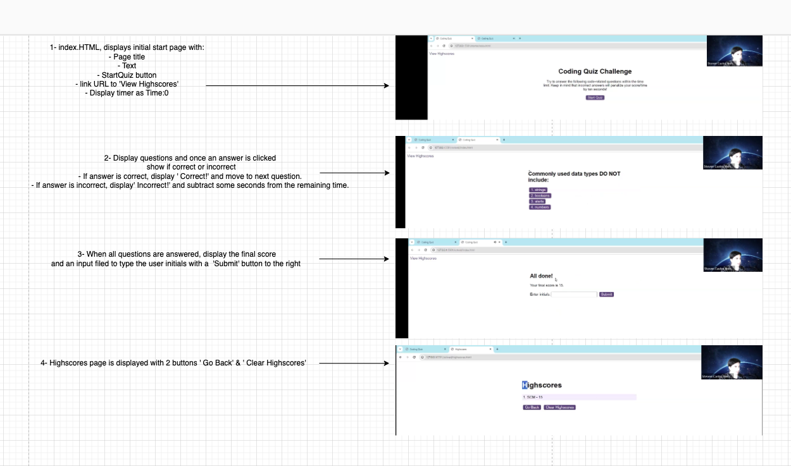

# Code-Quiz

This challenge will create a simple and timed, multiple-choice coding quiz that can keep track of high scores and quiz-takers' initials.

## Skills used / learned :

DOM manipulation, advanced JavaScript that feature dynamically updated HTML and CSS powered by JavaScript code.

## Deployed URL : 

## Wireframe tool used:
•	draw.io

# CREDIT:
- ChatGPT: https://chat.openai.com/
* How to create an array of questions and displaying them using a JS function?
* How to create a function to start a quiz?
* How to create a function for startTime the is decrementing as the time goes by
* How to validate answers to questions with a function in JS?
* How to save scores to local storage and display them in highscore.html?

- Classes recording :
* Functions and variables creations
* DOM explanation
* Timers settings

•	Full credit to students on the Discord group of helping each other’s out with couple of issues.
•	W3School 

## Resources:
•	W3School
•	ChatGPT
•	Google search engines
•	Classes recordings, activities and notes

## Installation:
•	To access the webpage, the following URL should be used:    “  ”. Once accessed, start the quiz by clicking on the ' Start Quiz" button.      
•	As a developer who wishes to access the back-end files for this page, you will need to access GitHub to be able to open the repo via the following link: "   "    

## Pseudocode:

### Below is a pseudo code outlining the requirements:

## pseudocode

1. Declare variables:
   - timeRemaining ,timeInterval, score , highscore, questions

2. Set up event listeners:
   A - When start button is clicked:
     - Start the timer
     - Show questions
     - Load the first question
     - Display 4 choices for the first question

    B - When the chosen answer button is clicked, do the following;
     - Check if the answer is correct
     
     - If correct: (If else code)
       - Increase score
     - else If incorrect:
       - Subtract time of 'n number' of seconds from the timer
     
    C - If no answer provided and time runs out then terminate 'Go to step G' to (End Quiz ());
    D - else, move to the next question
    F - Display choices for the next question

    G - When the timer reaches 0 or all questions are answered:
        - Stop the timer
        - Hide questions screen
        - Show end screen
        - Display final score
        - Allow user to enter and submit their initials

    H  - When submit button is clicked on the end screen:
        - Save the user initials and their score
        - Display score above two buttons of 'Go Back' & ' Clear Highscroes'

    I - When hignscores button is clicked:
      - Display the highscores
    
    J  - When clear button is clicked:
       - Clear the high scores

3.  Create functions to run codes for:
  - Function starting the quiz,
  - Function for starting the timer that will decrement the time and display the countdown of seconds in the 'timerElement'
  - Function that will end the quiz and claer timer if any time left
  - Function to display the questions
  - Function to validate the answer
  - Function to end the quiz
  - Function for localStorage  
   
   ### End results:

   
   
   
   
   
   
   
   
   
   
   
   
   
   
   
 

